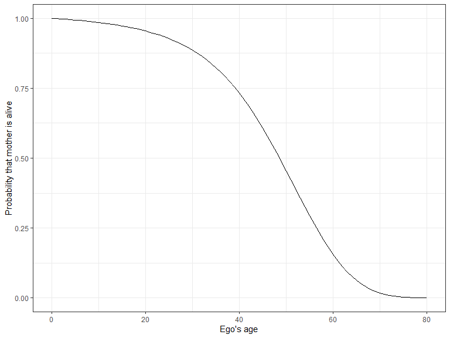

<style type="text/css">
  body{
  font-size: 12pt;
}
</style>


# Why kinship matters

- Socialisation, protection, and sustenance
- Inter-generational solidarity: exchanges and bequests
- Social structure and identity
- Early-life conditions $\rightarrow$ later-life outcomes

# The Goodman-Keyfitz-Pullum (GKP) equations

Let's review the principle of demographic ergodicity:

> A closed population with unchanging mortality and fertility rates has an implied (a) Intrinsic rate of natural increase $r$ and (2) age structure. 


```r
# Use Lexis matrices to show this
# Animation?
```

Goodman et al [-@goodman_family_1974]: **Stable populations also have an intrinsic kinship structure**:

> A fixed set of age-specific rates implies the probability that a girl aged *a* has a living mother and great-grandmother, as well as her expected number of daughters, sisters, aunts, nieces, and cousins. [@Keyfitz2005]

For example, this is the expected number of kin for an woman aged 50 ('Ego') in a female population that experiences the 2015 Swedish demographic rates ad-infinitum:


```{=html}
<div id="htmlwidget-577fb1c30d0b39939bb0" style="width:672px;height:480px;" class="DiagrammeR html-widget"></div>
<script type="application/json" data-for="htmlwidget-577fb1c30d0b39939bb0">{"x":{"diagram":"graph TD\n\n  GGM(ggm: <br>0)\n  GGM ==> GM(gm: <br>0.006)\n  GM  --> AOM(oa: <br>0.214)\n  GM  ==> M(m: <br>0.675)\n  GM  --> AYM(ya: <br>0.38)\n  AOM  --> CAOM(coa: <br>0.376)\n  M   --> OS(os: <br>0.419)\n  M   ==> E((Ego))\n  M   --> YS(ys: <br>0.467)\n  AYM  --> CAYM(cya: <br>0.42)\n  OS   --> NOS(nos: <br>0.388)\n  E   ==> D(d: <br>0.903)\n  YS   --> NYS(nys: <br>0.408)\n  D   ==> GD(gd: <br>0.034)\n  style GGM fill:#D9E9BE, stroke:#333, stroke-width:2px;\n  style GM  fill:#BF62CB, stroke:#333, stroke-width:2px, text-align: center;\n  style M   fill:#94C2DB, stroke:#333, stroke-width:2px, text-align: center\n  style D   fill:#dddbdb, stroke:#333, stroke-width:2px, text-align: center\n  style YS  fill:#79D297, stroke:#333, stroke-width:2px, text-align: center\n  style OS  fill:#79D297, stroke:#333, stroke-width:2px, text-align: center\n  style CAOM fill:#79D297, stroke:#333, stroke-width:2px, text-align: center\n  style AYM fill:#94C2DB, stroke:#333, stroke-width:2px, text-align: center\n  style AOM fill:#94C2DB, stroke:#333, stroke-width:2px, text-align: center\n  style CAYM fill:#79D297, stroke:#333, stroke-width:2px, text-align: center\n  style NOS fill:#CDA76A, stroke:#333, stroke-width:2px, text-align: center\n  style NYS fill:#CDA76A, stroke:#333, stroke-width:2px, text-align: center\n  style E   fill:#FFF, stroke:#333, stroke-width:4px, text-align: center\n  style D   fill:#CDA76A, stroke:#333, stroke-width:2px, text-align: center\n  style GD  fill:#C8695B, stroke:#333, stroke-width:2px, text-align: center"},"evals":[],"jsHooks":[]}</script>
```

## Living ancestors

The probability that a girl aged $a$ has a living mother in a stable population is:


\begin{equation}
M_1(a) = \int_{\alpha}^{\beta}{\frac{l(x+a)}{l(x)} e^{-rx}l(x)m(x) dx}.
(\#eq:m1a)
\end{equation}

where

- $\alpha$ and $\beta$ represent the start and the end of the reproductive period
- $m_x$ is a vector of age-specific fertility rates
- is a vector of survival probabilities $l_x$

Conditional on ego's survival, $M_1{(a)}$ can be thought of as a survival probability in a life table: it has to be equal to one when $a$ is equal to zero (the mother is alive when she gives birth), and goes monotonically to zero. 

We can also approximate $M_1(a)$ in relation to the mean age at childbearing $\mu$.
Assuming $\mu$ to be the average length of a generation in a stable population, we can rewrite Eq. \@ref(eq:m1a) as follows:

\begin{equation}
M_1(a) \approx \frac{l_{\mu + a}}{l_{\mu}}.
(\#eq:approx)
\end{equation}

Eq. \@ref(eq:approx) states that the probability that a girl alive at age $a$ has a living mother is approximately equal to the probability that women in the population are alive $a$ years past the mean age at childbearing, conditional on them being alive at the mean age at childbearing.


```r
# Compare actual and approx?
```

We can visualise this in a Lexis Diagram [@Keyfitz2005]:

<!-- -->

To generalise to older generations, let us first define the age distribution of the women as $W(x) = e^{-rx}l(x)m(x)$, so that Eq. \@ref(eq:m1a) becomes:

\begin{equation}
M_1(a) = \int_{\alpha}^{\beta}{\frac{l(x+a)}{l(x)} W(x)  dx}.
(\#eq:m1a)
\end{equation}

The average number of grandmothers is:

\begin{equation}
M_2(a) = \int_{\alpha}^{\beta}{ M_1(x+a) W(x) \:dx};
\label{eq:m2a}
\end{equation}

of great-grandmothers:

\begin{equation}
M_3(a) = \int_{\alpha}^{\beta}{ M_2(x+a) W(x) \:dx};
\label{eq:m3a}
\end{equation}

and so on.


## Living descendants

The average number of surviving children is:

\begin{equation}
B_1(a) = \int_{\alpha}^{a}{m(x) l(a-x) \: dx}
 (\#eq:b1)
\end{equation}

The expected number of surviving grandchildren is: 

\begin{equation}
B_2(a) = \int_{\alpha}^{a}{m(x)\int_{\alpha}^{a-x}{l(y) m(y) \: dy }\:dx}.
\label{eq:b2}
\end{equation}

## Removing the stable assumption

Demographic rates change constantly in the real world - populations are rarely stable. Each of the stable identities given above have a non-stable equivalent, but we won't cover these given time limitations. As an example, consider the non-stable equivalent of the GKP equation for the number of surviving children is. 

The expected number of surviving children for an average woman aged $a$ born in year $c$ in a non-stable population is:

\begin{equation}
B_1(a,c) \approx \sum_{x=\alpha}^{a}{F(x,c) l(a-x,c+x)}
\label{eq:b1_dic}
\end{equation}

where 

- $_1F_{(x,c)}$ represents age-specific fertility rates for cohort $c$ at age $x$
- $l_{(a-x,c+x)}$ are the survival probability until age $(a-x)$ for the cohort born in year $(c+x)$. It is the probability that the children of a woman who gave birth at age $x$ will survive until the woman potentially reaches age $a$. 

Note that the $(a-x,c+x)$ subscript allows us to replace the assumption of demographic stability present in the original formulation of the GKP equations with empirical rates.

## Implementation in R

1. Stable vs non-stable populations
1. One-sex vs two-sex populations
1. Recursive vs matrix implementations


```r
# 
```

## A Matrix Formulation

A recursive approach can get messy quickly For example, the expected number of younger sisters surviving to ego's age $a$ is:

\begin{equation}
S^{young}(a) = \int_{\alpha}^{\beta}{ \int_{0}^{a}{ \left[ \frac{l(x+u)}{l(x)} \right] m(x+u) l(a-u)\: du } \: e^{-rx}l(x)m(x) \: dx}
\label{eq:sis_young}
\end{equation}

where $l(x+u)/l(x)$ is the probability that the mother survives $u$ years after ego's birth. 

New developments by [@caswell_formal_2019;@caswell_formal_2020;@caswell_formal_2021;@caswell2021formal_two-sex].

# DemoKin: An R package to estimate kinship networks in stable and non-stable populations

**Iván Williams, Diego Alburez-Gutierrez, and Xi Song**; https://github.com/IvanWilli/DemoKin

# Rsoc: Demographic microsimulations in R made easy

**Tom Theile and Diego Alburez-Gutierrez**; https://github.com/tomthe/rsoc

Use the in-built functions in `Rsoc` to run a simple simulation from scratch. 


```r
# library(rsoc)

folder <- paste0(getwd(), "/rsoc")
seed <- 33

# name of the supplement-file, relative to the above folder:
supfile <- "sim_test.sup" 

# run1simulationwithfile starts a simulation with the specified sup-file
rsoc::run1simulationwithfile(folder, supfile, seed)
```


```r
"can't open  marriage file Hope that's OK
: No such file or directory
can't open  transition history file. Hope that's OK
: No such file or directoryü®


 Socsim Version: STANDARD-UNENHANCED-VERSION

openning rsoc/sim_test.sup 
openning rsoc/SWEfert2022 
openning rsoc/SWEmort2022 
offset 4321379 line4321379


 Adjusting fertility rates for 10 month birth interval 
reading fertility rates for: group=1 mstat=1 parity=0
+
reading fertility rates for: group=1 mstat=4 parity=0
+
opening pop pyramid file rsoc/output_pop.pyr
Reading initial population file rsoc/init_new.opop
No initial marriage file to read
No initial transition history file to read
Starting month is 601
Initial size of pop 8000  (living: 8000)
Rates imply simulation will have 4321379 groups
Initial population has max group id 4321379 
Simulation will have 4321379 groups

 checking rates for sanity
   ***NO MARRIAGE RATES for for  SINGLE male of ANY group

   ***NO MARRIAGE RATES for for  SINGLE female of ANY group


 - - - - - - - - - - - - - - - - - - - - - -  - - - - - 

Segment NO:	1 of 1 set to run with following macro options
Duration: 1200

-- I/O options --
Input pop file name	rsoc/init_new.opop
No marriage file read
Transition history file NOT read
Xtra variables NOT read

-- Fertility options --
Sex Ratio(prop male births):	 0.511200
Minimum Birth Interval:	10.000000 months
Fertility Multipler inheritance specified:no
Birth rate factors specified:no
Birth Targets Specified:no
Random_father disabled

-- Nuptiality Options --
marriage_queues==1
Endogamy/Exogamy: random
marriages evaluated by 'distribution' of age diff
mean/sd of agediff for females of group:1 : 2.000000/3.000000

-- Migration Options --
Transition rate targets set:no
child group identity :  inherited from MOTHER

  ||  ||  ||  ||  ||  ||  ||  ||  ||  ||  ||  ||  ||  ||


Simulating...
New events generated for all living persons
current month 601 stop month 1800 duration 1200
--------month:   1000  PopLive:  13318  Brths:   7 Dths:   1 Mrgs:   0 Dvs:   0 Mq:6734 Fq:0 -------
--------month:   1800  PopLive:  11865  Brths:   8 Dths:   9 Mrgs:   0 Dvs:   0 Mq:5931 Fq:0 -------
segment 1 complete current month: 1801


 Simulation Complete 
writing population (.opop) ..
writing marriages (.omar)..

rand_max: 32767total size of pop 22780

living size of pop 11865


Population Pyramid at the end of Segment 1  Month: 1801  
             All groups :Total Population: 11865
---------------MALE--------------------|--------------FEMALE-------------------
                                       |                                       
                                     MM|FF                                     
                                 MMMMMM|FFFFFF                                 
                               MMMMMMMM|FFFFFFFFFF                             
                             MMMMMMMMMM|FFFFFFFFFF                             
                             MMMMMMMMMM|FFFFFFFFFF                             
                             MMMMMMMMMM|FFFFFFFFFF                             
                           MMMMMMMMMMMM|FFFFFFFFFFFF                           
                           MMMMMMMMMMMM|FFFFFFFFFFFF                           
                           MMMMMMMMMMMM|FFFFFFFFFF                             
                           MMMMMMMMMMMM|FFFFFFFFFF                             
                             MMMMMMMMMM|FFFFFFFF                               
                             MMMMMMMMMM|FFFFFFFFFF                             
                             MMMMMMMMMM|FFFFFFFFFF                             
                             MMMMMMMMMM|FFFFFFFFFF                             
                             MMMMMMMMMM|FFFFFFFFFF                             
                             MMMMMMMMMM|FFFFFFFFFF                             
                               MMMMMMMM|FFFFFFFFFF                             
                               MMMMMMMM|FFFFFFFF                               
                               MMMMMMMM|FFFFFFFF                               
   ------+---------+---------+---------+---------+---------+---------+------
         15        10         5         0         5        10        15        


Population Pyramid at the end of Segment 1  Month: 1801  
             Group: 1  Total Population: 11865
---------------MALE--------------------|--------------FEMALE-------------------
                                       |                                       
                                     MM|FF                                     
                                 MMMMMM|FFFFFF                                 
                               MMMMMMMM|FFFFFFFFFF                             
                             MMMMMMMMMM|FFFFFFFFFF                             
                             MMMMMMMMMM|FFFFFFFFFF                             
                             MMMMMMMMMM|FFFFFFFFFF                             
                           MMMMMMMMMMMM|FFFFFFFFFFFF                           
                           MMMMMMMMMMMM|FFFFFFFFFFFF                           
                           MMMMMMMMMMMM|FFFFFFFFFF                             
                           MMMMMMMMMMMM|FFFFFFFFFF                             
                             MMMMMMMMMM|FFFFFFFF                               
                             MMMMMMMMMM|FFFFFFFFFF                             
                             MMMMMMMMMM|FFFFFFFFFF                             
                             MMMMMMMMMM|FFFFFFFFFF                             
                             MMMMMMMMMM|FFFFFFFFFF                             
                             MMMMMMMMMM|FFFFFFFFFF                             
                               MMMMMMMM|FFFFFFFFFF                             
                               MMMMMMMM|FFFFFFFF                               
                               MMMMMMMM|FFFFFFFF                               
   ------+---------+---------+---------+---------+---------+---------+------
         15        10         5         0         5        10        15        
"
```

```
## [1] "can't open  marriage file Hope that's OK\n: No such file or directory\ncan't open  transition history file. Hope that's OK\n: No such file or directoryü®\n\n\n Socsim Version: STANDARD-UNENHANCED-VERSION\n\nopenning rsoc/sim_test.sup \nopenning rsoc/SWEfert2022 \nopenning rsoc/SWEmort2022 \noffset 4321379 line4321379\n\n\n Adjusting fertility rates for 10 month birth interval \nreading fertility rates for: group=1 mstat=1 parity=0\n+\nreading fertility rates for: group=1 mstat=4 parity=0\n+\nopening pop pyramid file rsoc/output_pop.pyr\nReading initial population file rsoc/init_new.opop\nNo initial marriage file to read\nNo initial transition history file to read\nStarting month is 601\nInitial size of pop 8000  (living: 8000)\nRates imply simulation will have 4321379 groups\nInitial population has max group id 4321379 \nSimulation will have 4321379 groups\n\n checking rates for sanity\n   ***NO MARRIAGE RATES for for  SINGLE male of ANY group\n\n   ***NO MARRIAGE RATES for for  SINGLE female of ANY group\n\n\n\n - - - - - - - - - - - - - - - - - - - - - -  - - - - - \n\nSegment NO:\t1 of 1 set to run with following macro options\nDuration: 1200\n\n-- I/O options --\nInput pop file name\trsoc/init_new.opop\nNo marriage file read\nTransition history file NOT read\nXtra variables NOT read\n\n-- Fertility options --\nSex Ratio(prop male births):\t 0.511200\nMinimum Birth Interval:\t10.000000 months\nFertility Multipler inheritance specified:no\nBirth rate factors specified:no\nBirth Targets Specified:no\nRandom_father disabled\n\n-- Nuptiality Options --\nmarriage_queues==1\nEndogamy/Exogamy: random\nmarriages evaluated by 'distribution' of age diff\nmean/sd of agediff for females of group:1 : 2.000000/3.000000\n\n-- Migration Options --\nTransition rate targets set:no\nchild group identity :  inherited from MOTHER\n\n  ||  ||  ||  ||  ||  ||  ||  ||  ||  ||  ||  ||  ||  ||\n\n\nSimulating...\nNew events generated for all living persons\ncurrent month 601 stop month 1800 duration 1200\n--------month:   1000  PopLive:  13318  Brths:   7 Dths:   1 Mrgs:   0 Dvs:   0 Mq:6734 Fq:0 -------\n--------month:   1800  PopLive:  11865  Brths:   8 Dths:   9 Mrgs:   0 Dvs:   0 Mq:5931 Fq:0 -------\nsegment 1 complete current month: 1801\n\n\n Simulation Complete \nwriting population (.opop) ..\nwriting marriages (.omar)..\n\nrand_max: 32767total size of pop 22780\n\nliving size of pop 11865\n\n\n\n\nPopulation Pyramid at the end of Segment 1  Month: 1801  \n             All groups :Total Population: 11865\n---------------MALE--------------------|--------------FEMALE-------------------\n                                       |                                       \n                                     MM|FF                                     \n                                 MMMMMM|FFFFFF                                 \n                               MMMMMMMM|FFFFFFFFFF                             \n                             MMMMMMMMMM|FFFFFFFFFF                             \n                             MMMMMMMMMM|FFFFFFFFFF                             \n                             MMMMMMMMMM|FFFFFFFFFF                             \n                           MMMMMMMMMMMM|FFFFFFFFFFFF                           \n                           MMMMMMMMMMMM|FFFFFFFFFFFF                           \n                           MMMMMMMMMMMM|FFFFFFFFFF                             \n                           MMMMMMMMMMMM|FFFFFFFFFF                             \n                             MMMMMMMMMM|FFFFFFFF                               \n                             MMMMMMMMMM|FFFFFFFFFF                             \n                             MMMMMMMMMM|FFFFFFFFFF                             \n                             MMMMMMMMMM|FFFFFFFFFF                             \n                             MMMMMMMMMM|FFFFFFFFFF                             \n                             MMMMMMMMMM|FFFFFFFFFF                             \n                               MMMMMMMM|FFFFFFFFFF                             \n                               MMMMMMMM|FFFFFFFF                               \n                               MMMMMMMM|FFFFFFFF                               \n   ------+---------+---------+---------+---------+---------+---------+------\n         15        10         5         0         5        10        15        \n\n\nPopulation Pyramid at the end of Segment 1  Month: 1801  \n             Group: 1  Total Population: 11865\n---------------MALE--------------------|--------------FEMALE-------------------\n                                       |                                       \n                                     MM|FF                                     \n                                 MMMMMM|FFFFFF                                 \n                               MMMMMMMM|FFFFFFFFFF                             \n                             MMMMMMMMMM|FFFFFFFFFF                             \n                             MMMMMMMMMM|FFFFFFFFFF                             \n                             MMMMMMMMMM|FFFFFFFFFF                             \n                           MMMMMMMMMMMM|FFFFFFFFFFFF                           \n                           MMMMMMMMMMMM|FFFFFFFFFFFF                           \n                           MMMMMMMMMMMM|FFFFFFFFFF                             \n                           MMMMMMMMMMMM|FFFFFFFFFF                             \n                             MMMMMMMMMM|FFFFFFFF                               \n                             MMMMMMMMMM|FFFFFFFFFF                             \n                             MMMMMMMMMM|FFFFFFFFFF                             \n                             MMMMMMMMMM|FFFFFFFFFF                             \n                             MMMMMMMMMM|FFFFFFFFFF                             \n                             MMMMMMMMMM|FFFFFFFFFF                             \n                               MMMMMMMM|FFFFFFFFFF                             \n                               MMMMMMMM|FFFFFFFF                               \n                               MMMMMMMM|FFFFFFFF                               \n   ------+---------+---------+---------+---------+---------+---------+------\n         15        10         5         0         5        10        15        \n"
```

Analyze the output


# Applications

## Women's experience of child death

We [@alburez-gutierrez_womens_2021] showed that the number of children ever born to a woman aged $a$ born in cohort $c$ standing before us will be equal to the number of children who are currently alive plus the children who died before the woman reached age $a$:


\begin{equation}
\underbrace{CD(a,c,n)}_{\text{Child deaths}}= \underbrace{\sum_{x=15}^{x=a} {_1F_{x}(c,n)}}_{\text{Children born}}-\underbrace{\sum_{x=15}^{x=a} {_1F_{x}(c,n)} l_{a-x}(c+x,n)}_{\text{Children surviving or } CS(a,c,n) }
(\#eq:CD)
\end{equation}

where 

- $_1F_{x}(c,n)$ are single-year age-specific fertility rates for cohort $c$ and country $n$, at age $x$. The lower age boundary in this and all models is 15, representing the start of a woman's reproductive life. 
- $l_{a-x}(c+x,n)$ is the survival probability until age $(a-x)$ for the cohort born in year $(c+x)$ in country $n$. It is the probability that the children of a woman who gave birth at age $x$ will survive until the woman potentially reaches age $a$.   

Explore estimates using this online application: https://diego-alburez.shinyapps.io/child_death_demography/

## Sandwich Generation

Given constant age-specific schedules of fertility and mortality rates [@alburezgutierrez_sandwich_2021], we can express the probability of maternal sandwichness at age $a$, $S(a)$, as:

\begin{equation}
S(a) = \underbrace{\left(1 - \prod_{x=1}^{\kappa} [1 - m_{a-x})] \right)}_{\substack{\text{fertility risk in the}\\ \text{$\kappa$ years preceding age \emph{a}}}} \times \underbrace{M_1(a)}_{\substack{\text{Prob. that mother of ego}\\ \text{is alive when ego is \emph{a} years old}}} \times  \underbrace{\left(1-  \frac{M_1(a+\tau)}{M_1(a)}\right)}_{\substack{\text{Prob. that mother of ego}\\ \text{would die within $\tau$ years}}}    
\label{eq:sand}
\end{equation}


where $m_{a-x}$ is the fertility of women at age $a-x$ and $M_1(a)$ is the probability of having a living mother at age $a$ in a stable population. 
These estimates refer to an average woman in a female population, ignoring the role of offspring mortality.


# Other resources and studies

- Mortality shocks on kinship structure [@zagheni_impact_2011]
- Mortality multiplier [@verdery_tracking_2020]
- Kinship transitions: [Murphy]@murphy_long-term_2011;@verdery_links_2015] 
- Bereavement: [@smith-greenaway_global_2021]
- Unemployment in family networks [@song2021role]
- Kinship and historical memory: [@alburez-gutierrez_demographic_2021]
- Kin availability and family structure: [@wachter_kinship_1997] 
- Grandparenthood [@margolis_changing_2016;@margolis_cohort_2019]
- Kinlesness [@verdery2017projections]
<!-- - Inheritance of demographic behaviour: Kolk  -->
<!-- - Generational overlap:  -->


## References
