> **Get the `Rmd` version of this file: https://github.com/alburezg/DemoKin_example**


# The `DemoKin` package

`DemoKin` uses matrix demographic methods to compute expected (average) kin counts from demographic rates under a range of scenarios and assumptions. 
The package is an R-language implementation of Caswell [-@caswell_formal_2019;-@caswell_formal_2021] and draws on previous theoretical development by Goodman, Keyfitz and Pullum [-@goodman_family_1974]. 

Kin count estimation has a long history in mathematical demography, starting with the work of [@lotka1931orphanhood] on modeling orphanhood in theoretical populations across demographic regimes.
To the best of our knowledge, Brass [-@brass_derivation_1953] proposed the first kinship equation to estimate child survival over maternal age. 
Goodman et. al [-@goodman_family_1974] generalized this approach to sisters, granddaughters, cousins, etc., in stable and non-stable populations.
The so-called Goodman-Keyfitz-Pullum Kinship Equations were popularized by Keyfitz and Caswell [-@Keyfitz2005] and Bongaarts [-@bongaarts_projection_1987] used a similar approach to estimate descendants in his 'Family Status Model'.
More recently, Caswell [-@caswell_formal_2019;-@caswell_formal_2021] introduce the matrix approach that `DemoKin` is based on.

## Installation

You can install the development version from GitHub with:


```r
# install.packages("devtools")
devtools::install_github("IvanWilli/DemoKin")
# devtools::install_github("IvanWilli/DemoKin", build_vignettes = TRUE)
```

## The function `kin()`

`DemoKin::kin()` currently does most of the heavy lifting in terms of implementing matrix kinship models. 
This is what it looks like in action, in this case assuming demographic stability:


```r
library(DemoKin)
library(tidyverse)

stable <- 
  kin(
    U = swe_surv
    , f = swe_asfr
    , stable = TRUE
    , ego_year = 1950
    , selected_kin = NULL
    , living = TRUE
    )
```

### Arguments

- **U** matrix; survival ratio by age from a life table 
- **f** matrix; age specific fertility rate by age (simple ages). 
- **N** matrix; only needed for non-stable computation 
- **stable** logical string 
- **ego_year** string; period years of interest
- **ego_cohort** string; birth cohorts of interest
- **pi** matrix; distribution of ages of mothers (see Caswell [@-caswell_formal_2019])
- **birth_female** numeric; proportion of births that are female
- **selected_kin** string; relatives to compute. If `NULL`, return values for all relatives
- **living** logical; whether to compute values for living or deceased relatives 

Note that `DemoKin` only requires period demographic rate data as input!

### Details

Relatives for the `selected_kin` argument are identified by a unique code:


|Code |Relative                   |
|:----|:--------------------------|
|coa  |Cousins from older aunt    |
|cya  |Cousins from younger aunt  |
|d    |Daughter                   |
|gd   |Grand-daughter             |
|ggd  |Great-grand-daughter       |
|ggm  |Great-grandmother          |
|gm   |Grandmother                |
|m    |Mother                     |
|nos  |Nieces from older sister   |
|nys  |Nieces from younger sister |
|oa   |Aunt older than mother     |
|ya   |Aunt younger than mother   |
|os   |Older sister               |
|ys   |Younger sister             |

## Built-in data

The `DemoKin` package includes data from Sweden as an example. 
The data comes from the [Human Mortality Database](https://www.mortality.org/) and [Human Fertility Database](https://www.humanfertility.org/). 
These datasets were loaded using the`DemoKin::get_HMDHFD` function.
To list the data:


```r
data(package="DemoKin")
```


|Item     |Title                                                  |
|:--------|:------------------------------------------------------|
|swe_asfr |Swedish age-specific fertility rates from 1900 to 2015 |
|swe_pop  |Female swedish population from 1900 to 2015            |
|swe_surv |Female swedish survival ratios from 1900 to 2015       |

The in-built data sets are:

### `swe_surv` matrix; survival ratio by age (DemoKin's *U* argument)

The [appendix](#appendix) shows how to obtain these survival matrices from standard life tables. 
This is what the data looks like:


```r
swe_surv[1:4, 1:4]
```

```
##        1900      1901      1902      1903
## 2 0.9566306 0.9555890 0.9624144 0.9611063
## 3 0.9786518 0.9792724 0.9807146 0.9818320
## 4 0.9875967 0.9876130 0.9885345 0.9897997
## 5 0.9907708 0.9904054 0.9915360 0.9923815
```

And plotted over time and age:


```r
library(fields)

image.plot(
  x = as.numeric(colnames(swe_surv))
  , y = 0:nrow(swe_surv)
  , z = t(as.matrix(swe_surv))
  , xlab = "Year"
  , ylab = "Survival ratio (U)"
  )
```

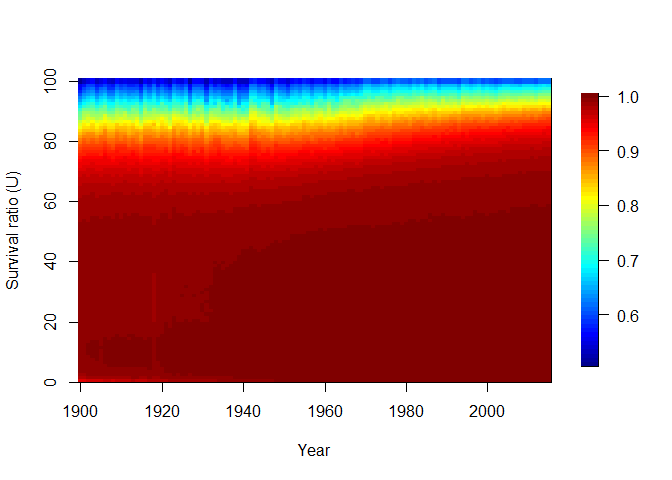<!-- -->

### `swe_asfr` matrix; age specific fertility rate (DemoKin's *f* argument)

This is what the data looks like:


```r
swe_asfr[1:4, 1:4]
```

```
##   1900 1901 1902 1903
## 1    0    0    0    0
## 2    0    0    0    0
## 3    0    0    0    0
## 4    0    0    0    0
```

And plotted over time and age:


```r
image.plot(
  x = as.numeric(colnames(swe_asfr))
  , y = 0:nrow(swe_asfr)
  , z = t(as.matrix(swe_asfr))
  , xlab = "Year"
  , ylab = "Age-specific fertility (f)"
  )
```

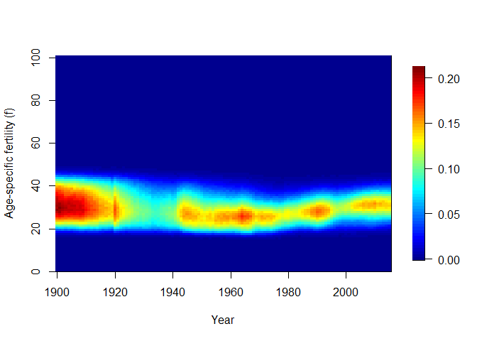<!-- -->

### `swe_pop` matrix; population by age (Demokin's *N* argument)

This is what the data looks like:


```r
swe_pop[1:4, 1:4]
```

```
## # A tibble: 4 x 4
##   `1900` `1901` `1902` `1903`
##    <dbl>  <dbl>  <dbl>  <dbl>
## 1  60917  62601  63337  63500
## 2  58927  57549  59573  60627
## 3  56823  57590  56426  58381
## 4  56473  55916  56887  55669
```

And plotted over time and age:


```r
image.plot(
  x = as.numeric(colnames(swe_pop))
  , y = 0:nrow(swe_pop)
  , z = t(as.matrix(swe_pop))
  , xlab = "Year"
  , ylab = "Population counts by age (N)"
  )
```

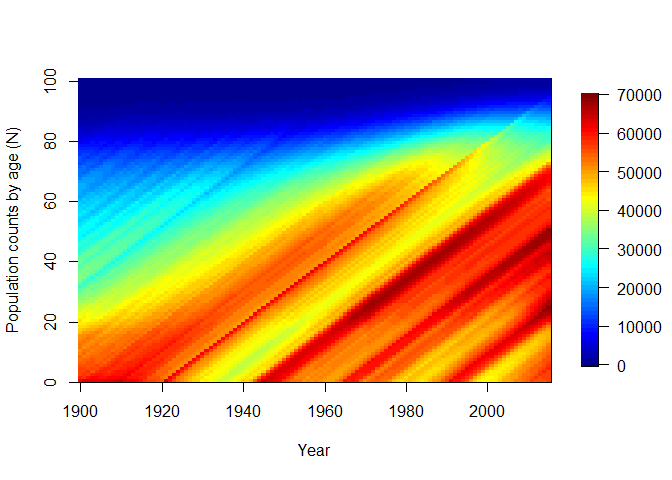<!-- -->

## Value

`DemoKin::kin()` returns a list containing two data frames: `kin_full` and `kin_summary`. 

### `kin_full` 

This data frame contains expected kin counts by year (or cohort), age of Ego and age of kin. 


```r
head(stable$kin_full)
```

```
##   year cohort age_ego kin age_kin alive count
## 1    0      0       0   d       0   yes     0
## 2    0      0       0   d       1   yes     0
## 3    0      0       0   d       2   yes     0
## 4    0      0       0   d       3   yes     0
## 5    0      0       0   d       4   yes     0
## 6    0      0       0   d       5   yes     0
```

### `kin_summary`

This is a 'summary' data frame derived from `kin_full`. To produce it, we sum over all ages of kin to produce a data frame of expected kin counts by year or cohort and age of Ego (but *not* by age of kin). 
This is how the `kin_summary` object is derived:


```r
kin_by_age_ego <- 
  stable$kin_full %>% 
  select(year, cohort, kin, age_ego, age_kin, count) %>% 
  group_by(year, cohort, kin, age_ego) %>% 
  summarise(count = sum(count)) %>% 
  ungroup()
```

```
## `summarise()` has grouped output by 'year', 'cohort', 'kin'. You can override using the `.groups` argument.
```

```r
# Check that they are identical

kin_by_age_ego %>% 
  identical(
    stable$kin_summary %>% 
      select(year, cohort, kin, age_ego, count) %>% 
      arrange(year, cohort, kin, age_ego)
  )
```

```
## [1] TRUE
```

# Example 1: kin counts in stable populations

Following Caswell [-@caswell_formal_2019], we assume a female closed population in which everyone experiences the Swedish 1950 mortality and fertility rates at each age throughout their life.
We then ask:

> How can we characterize the kinship network of an average member of the population (call her 'Ego')?

For this exercise, we'll use the Swedish data pre-loaded with `DemoKin`.


```r
library(DemoKin)

system.time(
  stable <- 
  kin(
    ego_year = 1950
    , U = swe_surv
    , f = swe_asfr
    , stable = TRUE
    )
)
```

```
##    user  system elapsed 
##    0.81    0.09    0.90
```

## 'Keyfitz' kinship diagram

We can visualize the implied kin counts for an Ego aged 35 yo in a stable population using a network or 'Keyfitz' kinship diagram [@Keyfitz2005] using the `plot_diagram` function:


```r
stable$kin_summary %>% 
  filter(age_ego == 35) %>% 
  select(kin, count) %>% 
  plot_diagram()
```

```{=html}
<div id="htmlwidget-93ee9de306f06df855b8" style="width:1152px;height:960px;" class="DiagrammeR html-widget"></div>
<script type="application/json" data-for="htmlwidget-93ee9de306f06df855b8">{"x":{"diagram":"graph TD\n\n  GGM(ggm: <br>0)\n  GGM ==> GM(gm: <br>0.138)\n  GM  --> AOM(oa: <br>0.352)\n  GM  ==> M(m: <br>0.824)\n  GM  --> AYM(ya: <br>0.519)\n  AOM  --> CAOM(coa: <br>0.545)\n  M   --> OS(os: <br>0.502)\n  M   ==> E((Ego))\n  M   --> YS(ys: <br>0.575)\n  AYM  --> CAYM(cya: <br>0.624)\n  OS   --> NOS(nos: <br>0.536)\n  E   ==> D(d: <br>0.928)\n  YS   --> NYS(nys: <br>0.31)\n  D   ==> GD(gd: <br>0)\n  style GGM fill:#a1f590, stroke:#333, stroke-width:2px;\n  style GM  fill:#a1f590, stroke:#333, stroke-width:2px, text-align: center;\n  style M   fill:#a1f590, stroke:#333, stroke-width:2px, text-align: center\n  style D   fill:#a1f590, stroke:#333, stroke-width:2px, text-align: center\n  style YS  fill:#a1f590, stroke:#333, stroke-width:2px, text-align: center\n  style OS  fill:#a1f590, stroke:#333, stroke-width:2px, text-align: center\n  style CAOM fill:#f1f0f5, stroke:#333, stroke-width:2px, text-align: center\n  style AYM fill:#f1f0f5, stroke:#333, stroke-width:2px, text-align: center\n  style AOM fill:#f1f0f5, stroke:#333, stroke-width:2px, text-align: center\n  style CAYM fill:#f1f0f5, stroke:#333, stroke-width:2px, text-align: center\n  style NOS fill:#f1f0f5, stroke:#333, stroke-width:2px, text-align: center\n  style NYS fill:#f1f0f5, stroke:#333, stroke-width:2px, text-align: center\n  style E   fill:#FFF, stroke:#333, stroke-width:4px, text-align: center\n  style D   fill:#a1f590, stroke:#333, stroke-width:2px, text-align: center\n  style GD  fill:#a1f590, stroke:#333, stroke-width:2px, text-align: center"},"evals":[],"jsHooks":[]}</script>
```


## Expected kin counts for an Ego surviving to each age

Before showing the results, we define a simple function to identify relatives based on their respective codes.
The kinship codes (e.g., "gm", "ggm") are useful for filtering the data but confusing for visualization. 


```r
rename_kin <- function(df, consolidate = F){
  
  if(!consolidate){
    
    relatives <- c("Cousins from older aunt", "Cousins from younger aunt", "Daughter", "Grand-daughter", "Great-grand-daughter", "Great-grandmother", "Grandmother", "Mother", "Nieces from older sister", "Nieces from younger sister", "Aunt older than mother", "Aunt younger than mother", "Older sister", "Younger sister")
    names(relatives) <- c("coa", "cya", "d", "gd", "ggd", "ggm", "gm", "m", "nos", "nys", "oa", "ya", "os", "ys")
    
  } else if(consolidate){
    
    # Combine kin types irrespective of whether they come from older
    # or younger sibling lines
    consolidate <- c("c", "c", "d", "gd", "ggd", "ggm", "gm", "m", "n", "n", "a", "a", "s", "s")
    names(consolidate) <- c("coa", "cya", "d", "gd", "ggd", "ggm", "gm", "m", "nos", "nys", "oa", "ya", "os", "ys")
    
    # Rename kin types from codes to actual words
    relatives <- c("Cousins", "Daughter", "Grand-daughter", "Great-grand-daughter", "Great-grandmother", "Grandmother", "Mother", "Nieces", "Aunt", "Sister")
    names(relatives) <-  unique(consolidate)
    
    df <- 
      df %>% 
      mutate(kin = consolidate[kin]) %>%
      group_by(age_ego, kin) %>%
      summarise(count = sum(count)) %>% 
      ungroup() 
    
  }
  df$kin <- relatives[df$kin]
  df  
}
```

Now, let's visualize how the expected number of daughters, siblings, cousins, etc., changes over the lifecourse of Ego.


```r
stable$kin_summary %>%
  rename_kin(., consolidate = T) %>% 
  ggplot() +
  geom_line(aes(age_ego, count))  +
  geom_vline(xintercept = 35, color=2)+
  theme_bw() +
  labs(x = "Ego's age") +
  facet_wrap(~kin)
```

```
## `summarise()` has grouped output by 'age_ego'. You can override using the `.groups` argument.
```

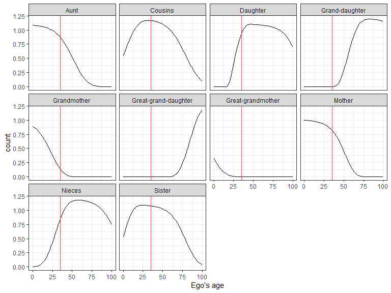<!-- -->

### Family size

How does overall family size (and family composition) vary over life for an average woman who survives to each age?


```r
counts <- 
  stable$kin_summary %>%
  group_by(age_ego) %>% 
  summarise(count = sum(count)) %>% 
  ungroup()

counts %>% 
  ggplot() +
  geom_line(aes(age_ego, count), size = 1)  +
  coord_cartesian(ylim = c(0, 6)) + 
  theme_bw() +
  labs(x = "Ego's age", y = "Number of living female relatives")
```

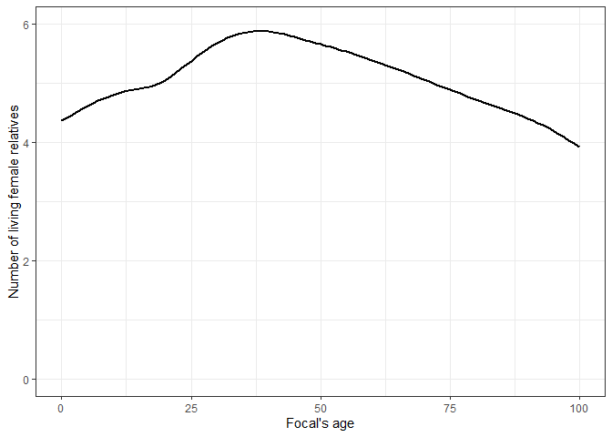<!-- -->

We can decompose this by relative type:


```r
stable$kin_summary %>%
  select(age_ego, kin, count) %>% 
  rename_kin(., consolidate = T) %>% 
  ggplot(aes(x = age_ego, y = count)) +
  geom_area(aes(fill = kin), colour = "black") +
  geom_line(data = counts, size = 2) +
  labs(x = "Ego's age", y = "Number of living female relatives") +
  coord_cartesian(ylim = c(0, 6)) + 
  theme_bw() +
  theme(legend.position = "bottom")
```

```
## `summarise()` has grouped output by 'age_ego'. You can override using the `.groups` argument.
```

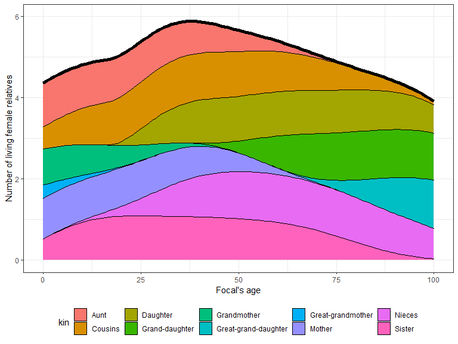<!-- -->

## Deceased kin

We have focused on living kin, but what about relatives who have died? 
We can get the cumulative number of kin deaths experienced by an average Ego surviving to a given age by setting the parameter `living = FALSE`.
This creates a new element `kin_death_by_age_ego` in the output value of `kin()`:


```r
stable_death <- 
  kin(
    ego_year = 1950
    , U = swe_surv
    , f = swe_asfr
    , stable = TRUE
    , living = FALSE
    )
```

### Non-cumulative counts of kin deaths experienced by Ego

We start by considering the number of kin deaths that an average can expect to experience at each age. In other words, the non-cumulative number of deaths in the family that Ego experiences at a given age.  


```r
loss1 <- 
  stable_death$kin %>%
  filter(alive =="no", age_ego>0) %>%
  group_by(age_ego) %>% 
  summarise(count = sum(count)) %>% 
  ungroup()

loss1 %>% 
  ggplot() +
  geom_line(aes(age_ego, count), size = 1)  +
  labs(x = "Ego's age", y = "Number of kin deaths experienced (non-cumulative)") +
  theme_bw()
```

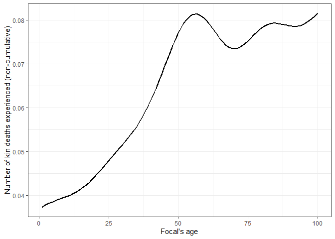<!-- -->

How are these deaths distributed by type of relative? 
We can decompose this by kin type:


```r
stable_death$kin %>%
  filter(alive =="no", age_ego>0) %>%
  group_by(age_ego, kin) %>% 
  summarise(count = sum(count)) %>% 
  ungroup() %>% 
  rename_kin(., consolidate = T) %>% 
  ggplot(aes(x = age_ego, y = count)) +
  geom_area(aes(fill = kin), colour = "black") +
  geom_line(data = loss1, size = 2) +
  labs(x = "Ego's age", y = "Number of kin deaths experienced (cumulative)") +
  theme_bw() +
  theme(legend.position = "bottom")
```

```
## `summarise()` has grouped output by 'age_ego'. You can override using the `.groups` argument.
## `summarise()` has grouped output by 'age_ego'. You can override using the `.groups` argument.
```

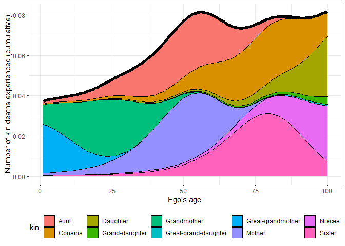<!-- -->

### Cumulative number of kin deaths

Now, we combine all kin types to show the cumulative burden of kin death for an average member of the population surviving to each age:


```r
loss2 <- 
  stable_death$kin_summary %>%
  filter(alive =="no") %>%
  group_by(age_ego) %>% 
  summarise(count = sum(total_cum)) %>% 
  ungroup()

loss2 %>% 
  ggplot() +
  geom_line(aes(age_ego, count), size = 1)  +
  labs(x = "Ego's age", y = "Number of kin deaths experienced (cumulative)") +
  theme_bw()
```

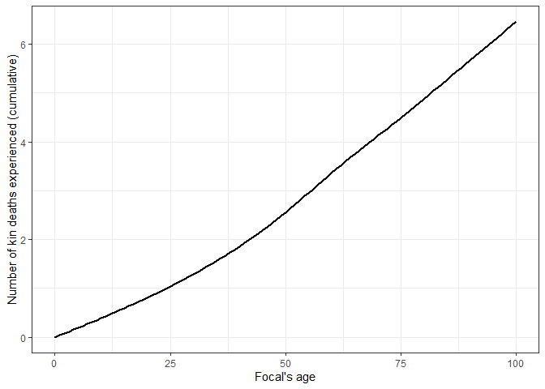<!-- -->

An member of the population aged 15, 50, and 65yo will have experienced, on average, the death of 0.6, 2.6, 3.7 relatives, respectively. 
We can decompose this by relative type:


```r
stable_death$kin_summary %>%
  filter(alive =="no") %>%
  group_by(age_ego, kin) %>% 
  summarise(count = sum(total_cum)) %>% 
  ungroup() %>% 
  rename_kin(., consolidate = T) %>% 
  ggplot(aes(x = age_ego, y = count)) +
  geom_area(aes(fill = kin), colour = "black") +
  geom_line(data = loss2, size = 2) +
  labs(x = "Ego's age", y = "Number of kin deaths experienced (cumulative)") +
  theme_bw() +
  theme(legend.position = "bottom")
```

```
## `summarise()` has grouped output by 'age_ego'. You can override using the `.groups` argument.
## `summarise()` has grouped output by 'age_ego'. You can override using the `.groups` argument.
```

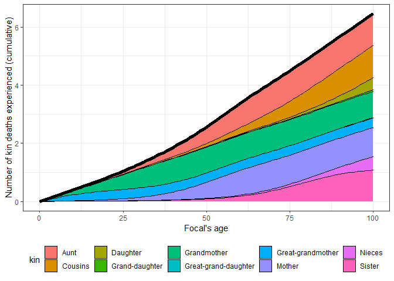<!-- -->

## Age distribution of relatives

How old are Ego's relatives? Using the `kin` data frame, we can visualize the age distribution of Ego's relatives throughout Ego's life. 
As an example, let's pick three points of Ego's life: when she's born (age=0) at the end of her reproductive life (age=50) and when she retires (age=65).


```r
stable$kin_full %>%
  filter(age_ego %in% c(0, 50, 65)) %>% 
  filter(kin %in% c("m", "d", "os", "ys")) %>%
  mutate(age_ego = as.character(age_ego)) %>% 
  rename_kin() %>% 
  ggplot() +
  geom_line(aes(age_kin, count, colour = age_ego), size = 1) +
  scale_color_discrete("Ego's age") +
  labs(x = "Age of Ego's kin", y = "Age distribution") +
  theme_bw() +
  facet_wrap(~kin)
```

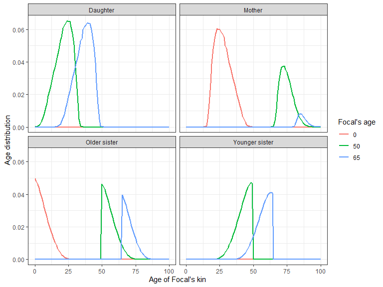<!-- -->

The output of the `DemoKin::kin()` function can also be used to easily determine the mean age Ego's relatives by kin type. 
For simplicity, let's focus on an Ego aged 35 yo and get the mean age (and standard deviation) of her relatives in our stable population. 


```r
ages_df <- 
  stable$kin_summary %>% 
  filter(age_ego == 35) %>% 
  select(kin, mean_age, sd_age)

ma <- 
  ages_df %>% 
  filter(kin=="m") %>% 
  pull(mean_age) %>% 
  round(1)

sda <- 
  ages_df %>% 
  filter(kin=="m") %>% 
  pull(sd_age) %>% 
  round(1)
```

We can say that the mothers of Ego would be, on average, 61.8 years old, with a standard deviation of 5.9 years. 

# Example 2: population with changing rates

The real population is Sweden is not stable: individuals in it experience changing mortality and fertility rates throughout their life.
Kinship structures in populations with changing rates can be computed following Caswell and Song [-@caswell_formal_2021].

All the outputs that we showed for stable populations in the previous section are also available for non-stable populations (e.g., kin counts, deceased kin, and age distributions). 
In this section we'll focus on outputs that are specific to time-varying kinship structures. 
In particular, we'll show period, cohort, and age results for Sweden (Figure 5 from Caswell and Song [-@caswell_formal_2021]). 

Note that, in order to arrive a this results, we use a different set of input values. 
The objects `U_caswell_2021`, `f_caswell_2021`, and `pi_caswell_2021` were extracted by Ivan from the supplementary materials provided by Caswell and Song [-@caswell_formal_2021].
They are included in DemoKin by default. 


```r
data(package="DemoKin")
```


|Item            |Title                                                                                               |
|:---------------|:---------------------------------------------------------------------------------------------------|
|U_caswell_2021  |Historic and projected survival ratios from Sweden used in Caswell (2021)                           |
|f_caswell_2021  |Historic and projected fertility ratios from Sweden used in Caswell (2021)                          |
|pi_caswell_2021 |Historic and projected mother´s age distribution of childbearing from Sweden used in Caswell (2021) |

## Period perspective

Our first illustration refers to a **period view** of kin counts. 
Following Caswell, we consider a population that experienced the demographic rates given as input to `DemoKin` and ask:

> How many living daughters would an average woman have at different ages, if we conducted a survey at a given point in time?

In order to provide these results, we re-run the `kin()` function with the `stable = FALSE` parameter and the input rates from Caswell and Song [-@caswell_formal_2021].
Note that we provide DemoKin with a vector of the period years for which we want to obtain the kin counts (i.e., in the `ego_year` argument). 


```r
system.time(
swe_period <- 
  kin(
    U = U_caswell_2021
    , f = f_caswell_2021
    , pi = pi_caswell_2021
    , stable = F
    , birth_female = 1
    # Note that we use the 'ego_year' parameters as input
    , ego_year = c(1891,1951,2050,2120)
    # We're only interested in certain kin ties
, selected_kin = c("d","gd","m","gm","os","ys")
)
)
```

```
## Assuming stable population before 1891.
```

```
##    user  system elapsed 
##   49.84    0.43   50.86
```

Now, we plot the expected number of daughters that Ego throughout her life at different points in time:


```r
swe_period$kin_summary %>%
  filter(kin == "d") %>% 
  rename_kin() %>% 
  mutate(year = factor(year)) %>% 
  ggplot(aes(age_ego,count,color=year)) +
  geom_line(size=1)+
  labs(x = "Ego's age", y = "Number of daughters") + 
  theme_bw() +
  theme(legend.position = "bottom")
```

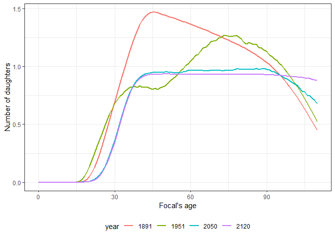<!-- -->

In a similar way, we can ask, how many grand-daughters, sisters, etc., would an average woman have at different points in time?


```r
swe_period$kin_summary %>%
  rename_kin() %>% 
  mutate(year = factor(year)) %>% 
  ggplot(aes(age_ego,count,color=year)) +
  geom_line(size=1)+
  facet_wrap(~kin, scales = "free")+
  labs(x = "Ego's age", y = "Kin count") + 
  theme_bw() +
  theme(legend.position = "bottom")
```

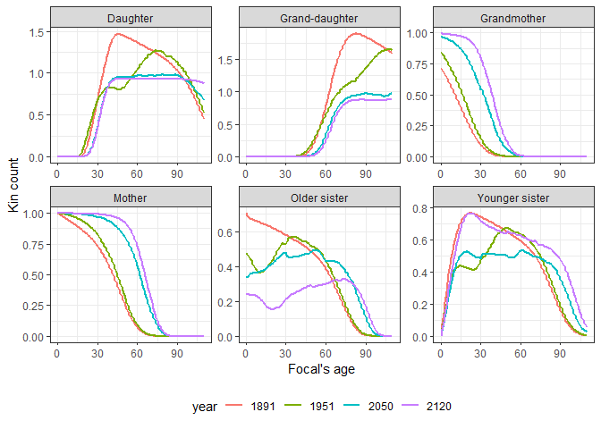<!-- -->

## Cohort perspective

We can also visualize the results from a **cohort perspective**. 
This would be useful if we were interested in knowing the number of daughters of women in a given cohort at different points in time. 
We could as, for example:

> How many (living) daughters have women born in year 1951 accumulated by the year 2000, on average?

For a cohort perspective, we run the `kin()` function with the `stable = FALSE` parameter and with a vector of `ego_year` values:
  

```r
system.time(
  swe_coh <- 
    kin(
      U = U_caswell_2021
      , f = f_caswell_2021
      , pi = pi_caswell_2021
      , stable = F
      , birth_female = 1
      # Note that we use the 'ego_cohort' parameters as input
      , ego_cohort = c(1891,1931,1971,2041)
      # We're only interested in certain kin ties
      , selected_kin = c("d","gd","m","gm")
    )
)
```

```
## Assuming stable population before 1891.
```

```
##    user  system elapsed 
##   70.93    0.14   71.62
```

Now, we can show the expected number of daughters that women born in different cohorts have at their disposal in any given year:


```r
swe_coh$kin_summary %>%
  filter(kin == "d") %>% 
  rename_kin() %>% 
  mutate(cohort = factor(cohort)) %>% 
  ggplot(aes(year,count,color=cohort)) +
  scale_y_continuous(labels = seq(0,3,.2),breaks = seq(0,3,.2))+
  geom_line(size=1)+
  labs(x = "Year", y = "Number of daughters") + 
  theme_bw() +
  theme(legend.position = "bottom")
```

<!-- -->

We can do the same thing for other kin types to show the expected number of kin for women born in a given cohort across time:


```r
swe_coh$kin_summary %>%
  rename_kin() %>% 
  mutate(cohort = factor(cohort)) %>% 
  ggplot(aes(year,count,color=cohort)) +
  scale_y_continuous(labels = seq(0,3,.2),breaks = seq(0,3,.2))+
  geom_line(size=1)+
  facet_wrap(~kin,scales = "free")+
  labs(x = "Year", y = "Kin count") + 
  theme_bw() +
  theme(legend.position = "bottom")
```

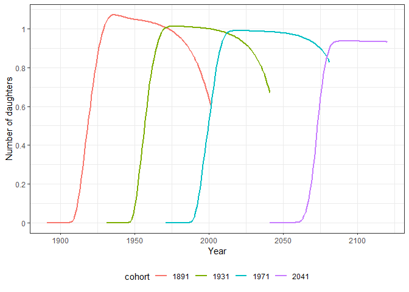<!-- -->

# In the pipeline

1. Hex logo for package
1. Implement multi-stage [@caswell_formal_2020] and two-sex models [@caswell2021formal_two-sex]
1. Improve Keyfitz kinship diagrams
1. Improve documentation and vignette of package 

<!-- 1. Functions to transform common demographic data sources (HMD, HFD, UNWPP) to DemoKin input -->
  
# Get involved!
  
`DemoKin` is giving its first steps.
Please contact us via email, or create an issue or submit a pull request on GitHub.
You can also get in touch directly: 
  
- GitHub: 
    + https://github.com/IvanWilli/DemoKin
- Ivan: 
    + ivanwilliams1985[at]gmail.com
    + https://twitter.com/ivanchowilliams
    + https://github.com/IvanWilli
- Diego
    + alburezgutierrez[at]demogr.mpg.de
    + https://twitter.com/d_alburez
    + www.alburez.me

# Acknowledgement

We thank Hal Caswell for sharing code and data from his Demographic Research papers. 
Mallika Snyder provided useful comments on an earlier version of this handout.


# Appendix: Obtaining U matrix from a life table {#appendix}

Here, we show how to estimate the argument **U** from `DemoKin::kin()` (survival ratio by age from a life table) from a standard life table.
The code is part of the function `DemoKin::get_HMDHFD()`.
For this example, we use Swedish period life tables from the Human Mortality Database. 


```r
library(tidyverse)

lt <- read.table("fltper_1x10.txt", header = T, skip = 2) 

lt$Age[lt$Age == "110+"] <- 110
lt$Age <- as.numeric(lt$Age)

age = 0:100
ages = length(age)
w = last(age)

# survival probabilities
L <- lt %>%
  filter(Age<=w) %>%
  mutate(Lx = ifelse(Age==w, Tx, Lx)) %>%
  select(Year, Age, Lx) %>%
  spread(Year, Lx) %>%
  select(-Age)

U <- rbind(L[c(-1,-101),]/L[-c(100:101),],
           L[101,]/(L[100,]+L[101,]),
           L[101,]/(L[100,]+L[101,]))
   
rownames(U) <- age
colnames(U) <- unique(lt$Year)
U[is.na(U)] <- 0

U[1:4, 1:4]
```

```
##   1751-1759 1760-1769 1770-1779 1780-1789
## 0 0.8990951 0.8959954 0.8954728 0.9046334
## 1 0.9494330 0.9520463 0.9402367 0.9476692
## 2 0.9662034 0.9679407 0.9606561 0.9650853
## 3 0.9737870 0.9734861 0.9685377 0.9726419
```

# Session Information


```r
sessionInfo()
```

```
## R version 4.0.2 (2020-06-22)
## Platform: x86_64-w64-mingw32/x64 (64-bit)
## Running under: Windows 10 x64 (build 19044)
## 
## Matrix products: default
## 
## locale:
## [1] LC_COLLATE=English_United Kingdom.1252 
## [2] LC_CTYPE=English_United Kingdom.1252   
## [3] LC_MONETARY=English_United Kingdom.1252
## [4] LC_NUMERIC=C                           
## [5] LC_TIME=English_United Kingdom.1252    
## 
## attached base packages:
## [1] grid      stats     graphics  grDevices utils     datasets  methods  
## [8] base     
## 
## other attached packages:
##  [1] fields_11.6        spam_2.6-0         dotCall64_1.0-1    knitr_1.31        
##  [5] forcats_0.5.1      stringr_1.4.0      dplyr_1.0.5        purrr_0.3.4       
##  [9] readr_1.4.0        tidyr_1.1.3        tibble_3.1.0       ggplot2_3.3.3     
## [13] tidyverse_1.3.0    DemoKin_0.0.0.9000
## 
## loaded via a namespace (and not attached):
##  [1] Rcpp_1.0.7         lubridate_1.7.10   visNetwork_2.0.9   assertthat_0.2.1  
##  [5] digest_0.6.28      utf8_1.2.1         R6_2.5.0           cellranger_1.1.0  
##  [9] backports_1.2.1    reprex_1.0.0       evaluate_0.14      highr_0.8         
## [13] httr_1.4.2         pillar_1.5.1       rlang_0.4.10       readxl_1.3.1      
## [17] rstudioapi_0.13    jquerylib_0.1.4    rmarkdown_2.7      DiagrammeR_1.0.6.1
## [21] labeling_0.4.2     htmlwidgets_1.5.3  munsell_0.5.0      broom_0.7.5       
## [25] compiler_4.0.2     modelr_0.1.8       xfun_0.21          pkgconfig_2.0.3   
## [29] htmltools_0.5.1.1  tidyselect_1.1.0   bookdown_0.21      fansi_0.4.2       
## [33] crayon_1.4.1       dbplyr_2.1.0       withr_2.4.1        jsonlite_1.7.2    
## [37] gtable_0.3.0       lifecycle_1.0.0    DBI_1.1.1          magrittr_2.0.1    
## [41] scales_1.1.1       cli_2.3.1          stringi_1.5.3      farver_2.1.0      
## [45] fs_1.5.0           xml2_1.3.2         bslib_0.2.5        ellipsis_0.3.1    
## [49] generics_0.1.0     vctrs_0.3.7        RColorBrewer_1.1-2 tools_4.0.2       
## [53] glue_1.4.2         maps_3.3.0         hms_1.0.0          yaml_2.2.1        
## [57] colorspace_2.0-0   rvest_1.0.0        haven_2.3.1        sass_0.4.0
```

# References
